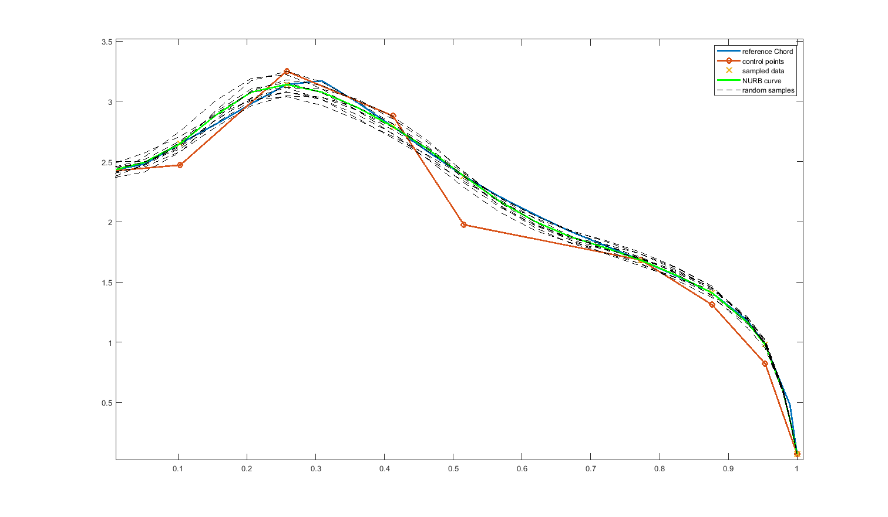
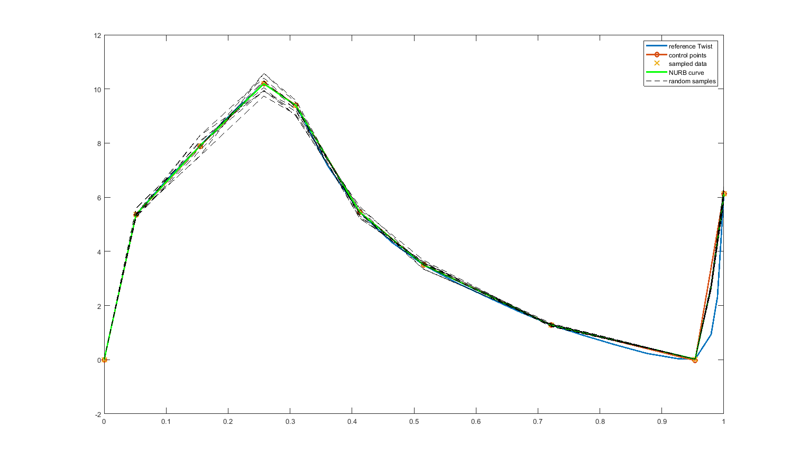
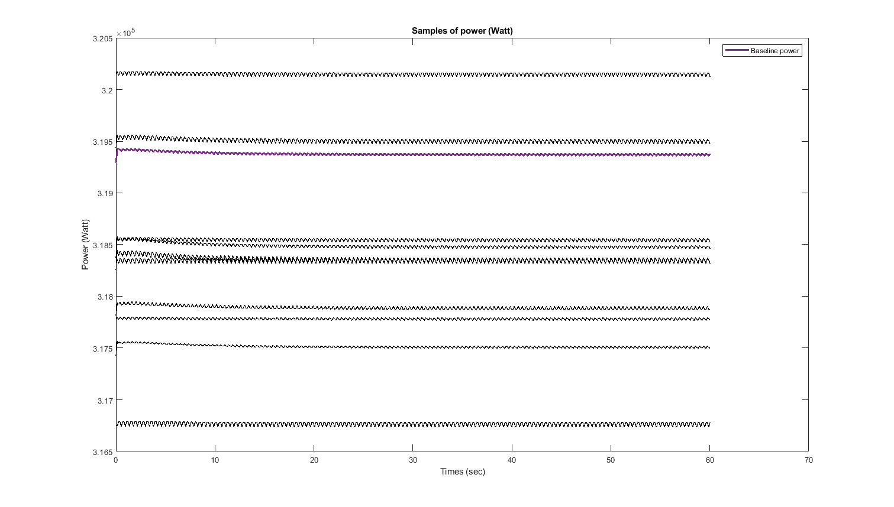
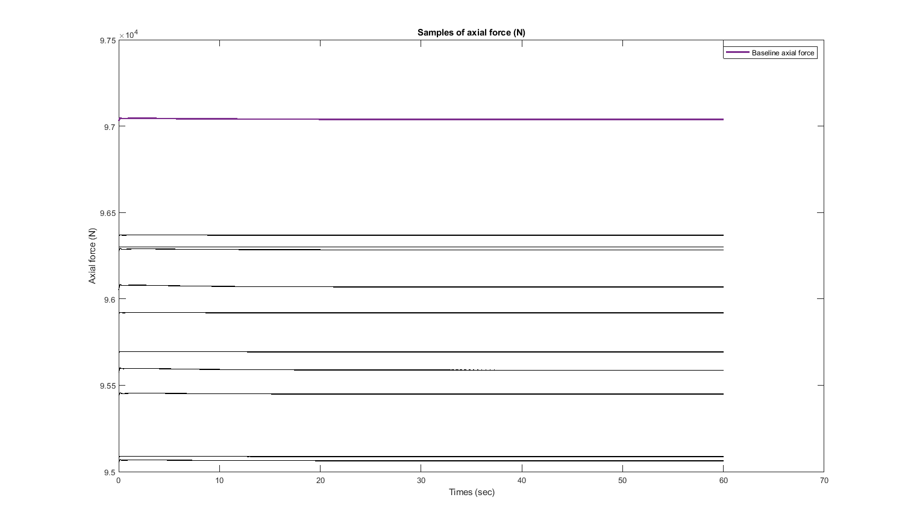

# AEROmoduleWrapper
Contains MATLAB routines for computing samples of power and axial force using the ECNAERO module package. The uncertainty is introduced by perturbing the baseline twist and chord curve. The perturbation is based on the Non-Uniforms Rational B-splines (NURBS).

## generateAeroModuleSamples.m
Computes the sample for power and axial force. Below is the result for 5% uncertainty in the control points of twist and chord.

