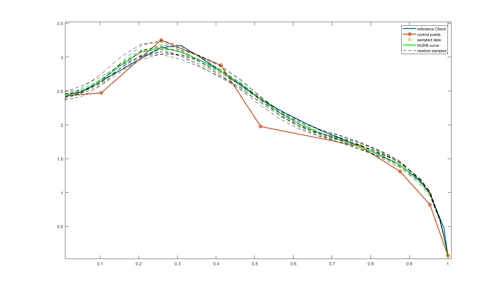
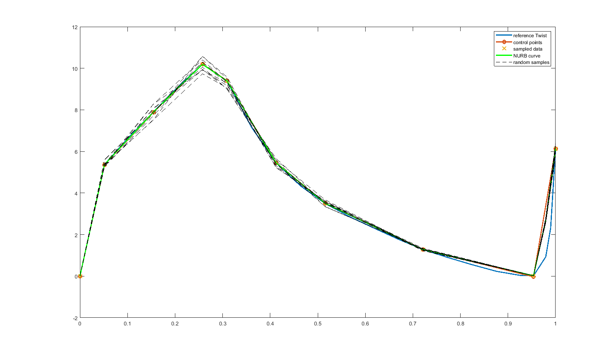
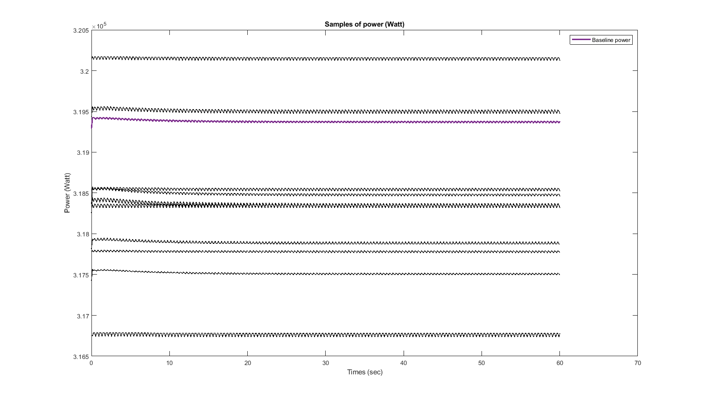
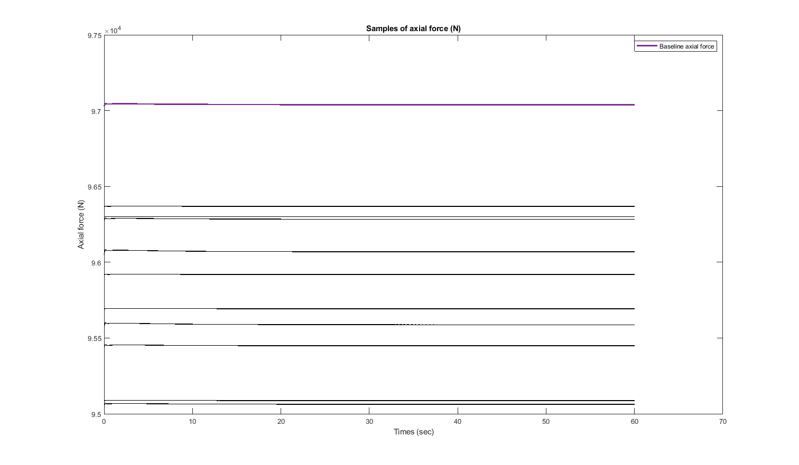

# AEROmoduleWrapper
Contains MATLAB routines for computing samples of power and axial force using the ECN AERO module package. The uncertainty is introduced by perturbing the baseline twist and chord curve. The perturbation is based on the Non-Uniforms Rational B-splines (NURBS).

## generateAeroModuleSamples.m
Computes samples for power and axial force using the AERO module package. Below is the result for plus minus 5% perturbation in the baseline control points of twist and chord, respectively.

Below are the samples of power production and axial force for the 10 samples.

