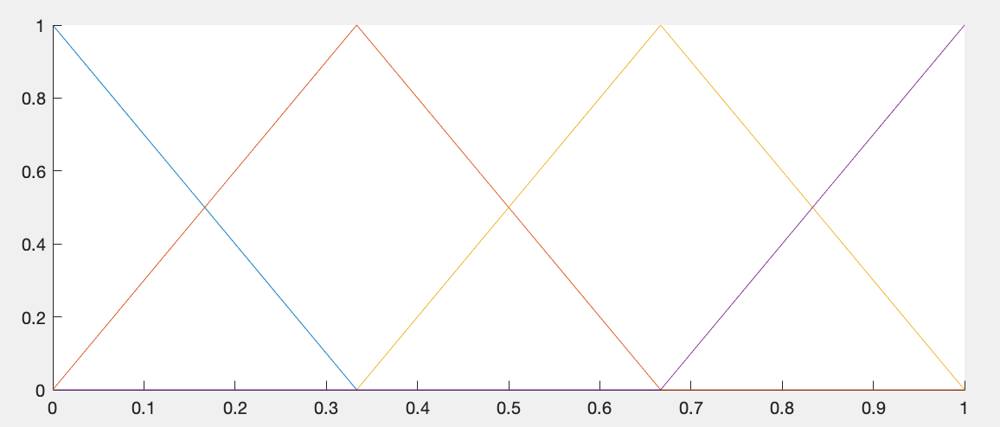
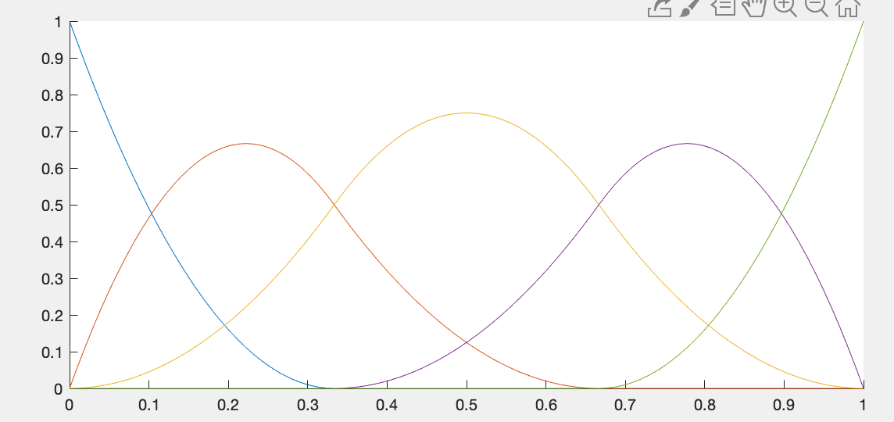
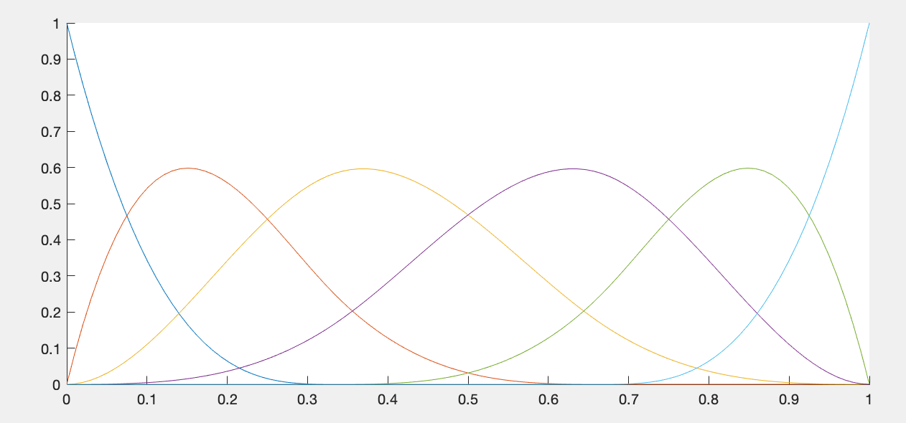

# NURBS
Contains MATLAB routines for pertubing a curve based on the Non-Uniforms Rational B-splines (NURBS).

## generateBsplines.m 
Computes the basis splines for a given knot vector 't0' and NURBS order 'n'.

For t0 = [0 1/3 2/3 1] and for n =2,3,4 we get linear, quadratic and cubic basis, respectively.

##test_ControlPoints
This routine computes control points c for B-splines that corresponds to sampled data.

##test_perturbNURBS
This routine computes perturbed samples obtained from perturbing control points of baseline curve

