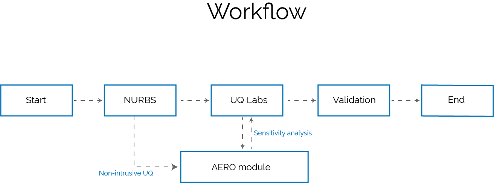

# UQ4WIND: UQ for aeroelastic wind turbine models

This repository contains Matlab routines to perform UQ of wind turbine models.
-The main code for sensitivity analysis and calibration is in the folder UQ_analysis.
-Please check the readme.txt in the UQ_analysis folder.

